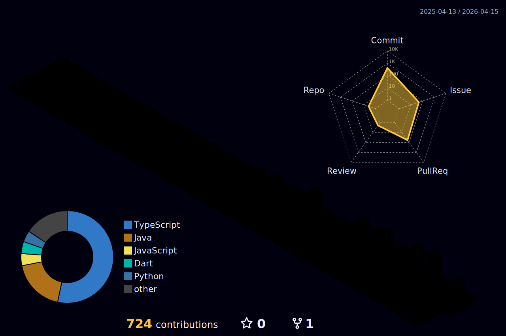

---

### About

Computer Engineering student at McGill University based in Montréal. I transform ideas into practical tools, with focus on AI, cloud computing, and web technologies for fintech and retail.

---

### Tech Stack

  

---

### Experience

| Role | Organization | Period |
|------|--------------|--------|
| Claude Campus Ambassador | Anthropic | 2026 |
| Software Engineer Partner | LetA Tech Ltd | 2025 |
| Liaison Agent | R.A.P Jeunesse | 2021–2024 |

---

### Projects

**SIY (Style It Yourself)** — Personal stylist app with digital closet and fitting room. Built with Next.js, Supabase, FastAPI.

**Scikit Stock Screener** — 2nd place at McGill ML Hackathon 2025. Stock picker tool using ML.

**Financial Sentiment Analyzer** — Text analysis app powered by fine-tuned FinBERT.

**Flight Management System** — Full-stack school project with booking and scheduling features.

---

### GitHub Stats

<!-- 3D Contribution Graph - requires GitHub Action setup -->

  

<!-- Snake Animation - requires GitHub Action setup -->

<picture>
  <source media="(prefers-color-scheme: dark)" srcset="https://raw.githubusercontent.com/thaimtl/thaimtl/output/github-snake-dark.svg" />
  <source media="(prefers-color-scheme: light)" srcset="https://raw.githubusercontent.com/thaimtl/thaimtl/output/github-snake.svg" />
  
</picture>

---

### Education

**B.Eng. Computer Engineering** — McGill University (2024–2028)

Currently learning: AWS Cloud Practitioner certification, hands-on deployment with EC2, S3, Lambda

---

### Languages

English · French · Vietnamese

---

Also into art, fashion, and amateur photography.

