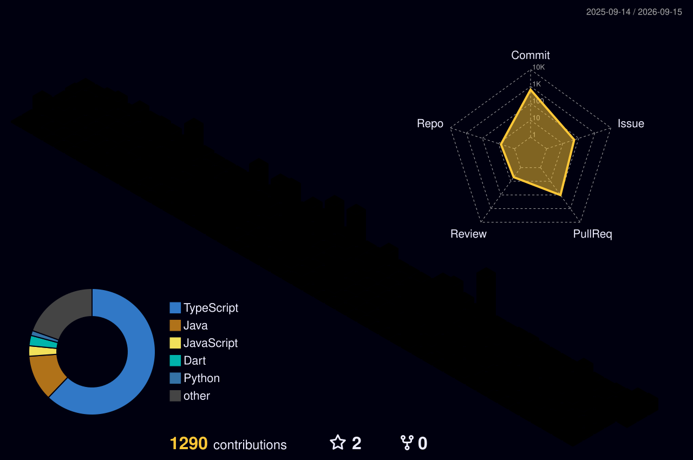

---

### Something About Me

My bet is on agentic AI and world models - currently doing some private researches in these areas.  

I'm also building an agentic digital closet, feel free reach out if you wanna bounce ideas!

---

### Tech Stack

  

---

### GitHub Stats

<!-- 3D Contribution Graph - requires GitHub Action setup -->

  

<!-- Snake Animation - requires GitHub Action setup -->

<picture>
  <source media="(prefers-color-scheme: dark)" srcset="https://raw.githubusercontent.com/thaimtl/thaimtl/output/github-snake-dark.svg" />
  <source media="(prefers-color-scheme: light)" srcset="https://raw.githubusercontent.com/thaimtl/thaimtl/output/github-snake.svg" />
  
</picture>

---

### My Time at University 

**B.Eng. Computer Engineering** — McGill University (2024–2028)

I really hate circuit and electronic classes. 
I really love programming and software classes.

Claude and the wave of agentic engineering reshaped my view of software engineering, for the better.  
While many of my peers focused on finding an AI-proof SWE career, I thrived on learning agentic workflows and leveraging AI to learn and build things I'm passionate about. 
I believe this is what SWE was always about: to use the right tools to build the right thing.  
AI is just one of those tools. It is now no less part of my tech stack than supabase, vercel, or github. 

I genuinely find only 20% of my coursework is actually up-to-date, interesting and useful. 
The other 80% of the web programming and practical SWE skills I know come from online courses like Harvard's CS50, YouTube, and books. 

I stopped training LeetCode for the sake of passing OAs and interviews, because I realized it was a waste of time.  
What's the point of solving the same set of "puzzles" over and over again when you could have used that time to build something great? 
Don't get me wrong, I still find DSA concept matters (but only to a certain extent). 

I met most of the coolest friends outside of my program, through clubs I'm passionate about. They changed my mindset and views, all for the better.  
So if you are reading this and you are at uni, go find a club/community to join, and get out of your bubble. 

---

### Languages (in order of how often I mess them up)

English 
Vietnamese 
French 

---

Also into art, fashion, chess and photography...

 

*Saint George and the Dragon* — Briton Rivière (1908-1909)

This is my favorite painting so far, found it at Le Musée des Beaux-Arts de Montréal and it stuck with me. Unlike most Saint George paintings showing the hero mid-battle, Rivière captures the aftermath where the knight lies exhausted beside his fallen dragon, and his horse dead beneath the beast's coils. This shows that victory is not just all glory, but achieved through persistence, hardwork and sacrifice...

